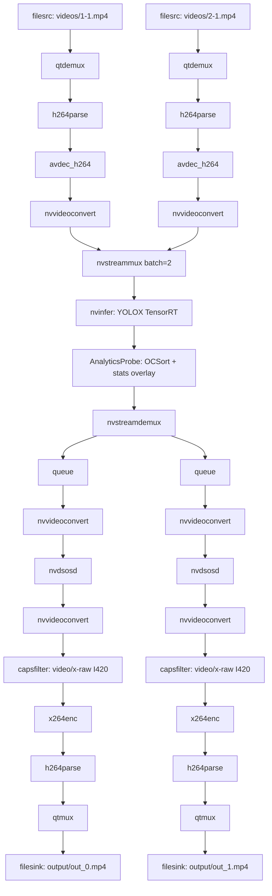

# PipelineManager: Local Two-Source DeepStream Pipeline

Tài liệu này mô tả pipeline runtime local sau khi cắt backend, counting, mapping và Janus/WebRTC.

## 1. Trách nhiệm

`PipelineManager` chịu trách nhiệm:

- Tạo 2 input branches từ video files.
- Decode H.264 bằng software fallback `avdec_h264` trên Windows/WSL2.
- Chuyển frame về NVMM bằng `nvvideoconvert` để đưa vào DeepStream.
- Gom 2 stream vào `nvstreammux` với batch size đọc từ config.
- Chạy YOLOX qua `nvinfer` với TensorRT engine.
- Gọi `AnalyticsProbe` để chạy OCSort per source, đồng bộ track IDs và render runtime overlay.
- Tách stream bằng `nvstreamdemux`.
- Ghi mỗi stream ra một file mp4 riêng bằng `x264enc` software encoder.
- Quản lý lifecycle: build, attach probe, run, stop.

## 2. Pipeline structure hiện tại



## 3. Vì sao dùng software codec fallback?

Trên Docker Desktop + WSL2, NVIDIA V4L2 codec có thể không chạy ổn:

```text
nvv4l2decoder  → S_EXT_CTRLS for CUDA_GPU_ID failed
nvv4l2h264enc  → ENC_CTX Error in initializing nvenc context
```

Vì vậy runtime local mặc định dùng:

- Decode: `avdec_h264`
- Encode: `x264enc`

Các package cần thiết được cài trong Dockerfile:

```text
gstreamer1.0-libav
gstreamer1.0-plugins-ugly
libavcodec58 libavutil56 libavformat58
libmpg123-0 libvpx7 libx264-163 libx265-199
```

## 4. Config-driven properties

Pipeline properties được điều khiển bởi:

- `config/sources_config.json`
- `config/pipeline_config.json`
- `config/yolox_config.json`
- `config/config_infer.txt`

Không hardcode input/output path, width/height, decoder, encoder, batch size hoặc bitrate trong `manager.py` nếu giá trị đó đã có trong config.

Config codec hiện tại:

```json
"decode": {
  "parser": "h264parse",
  "decoder": "avdec_h264",
  "converter": "nvvideoconvert"
},
"output": {
  "encoder": "x264enc",
  "bitrate": 4000000
}
```

Lưu ý: `x264enc.bitrate` dùng đơn vị kbit/s, nên code chuyển `4000000` bit/s trong config thành `4000` kbit/s khi set property.

## 5. Runtime logs và overlay

`AnalyticsProbe` dùng:

- `RuntimeStatsManager` để tính/log FPS, detections, tracks.
- `RuntimeOverlayRenderer` để render text overlay lên video.

Log mẫu:

```text
[Stats] source=0 | frame=629 | fps=25.4 | detections=5 | tracks=1 | total_fps=50.8 | total_detections=7 | total_tracks=3
```

Overlay trên video:

```text
CAM 0 | FPS 25.4 | DET 5 | TRACKS 1 | FRAME 629
```

## 6. Runtime outputs

Kết quả nằm ở:

```text
output/out_0.mp4
output/out_1.mp4
```

`output/` được ignore trong git và Docker build context.

## 7. Không còn dùng

Pipeline local không còn:

- Janus/WebRTC branch.
- UDP/RTP streaming.
- Backend WebSocket.
- Counting line OSD.
- Mapping overlay.
