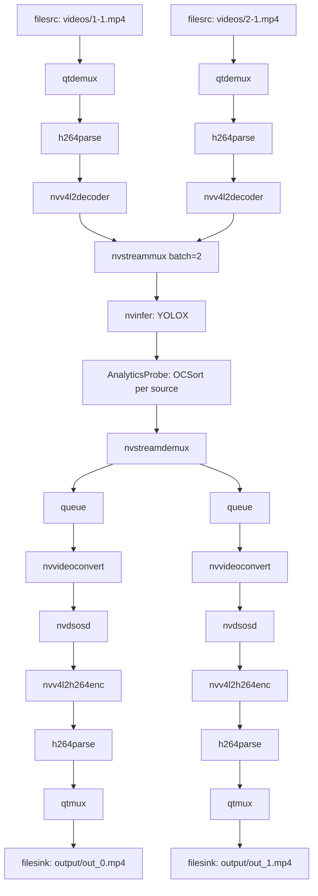

# PipelineManager: Local Two-Source DeepStream Pipeline

Tài liệu này mô tả pipeline runtime local sau khi cắt backend, counting, mapping và Janus/WebRTC.

## 1. Trách nhiệm

`PipelineManager` chịu trách nhiệm:

- Tạo 2 input branches từ video files.
- Gom 2 stream vào `nvstreammux` với batch size đọc từ config.
- Chạy YOLOX qua `nvinfer`.
- Tách stream bằng `nvstreamdemux`.
- Ghi mỗi stream ra một file mp4 riêng.
- Quản lý lifecycle: build, attach probe, run, stop.

## 2. Pipeline Structure



## 3. Config-driven properties

Pipeline properties are controlled by:

- `config/sources_config.json`
- `config/pipeline_config.json`
- `config/yolox_config.json`

Không hardcode input/output path, width/height, batch size hoặc bitrate trong `manager.py`.

## 4. Runtime outputs

Kết quả nằm ở:

```text
output/out_0.mp4
output/out_1.mp4
```

## 5. Không còn dùng

Pipeline local không còn:

- Janus/WebRTC branch.
- UDP/RTP streaming.
- Backend WebSocket.
- Counting line OSD.
- Mapping overlay.
